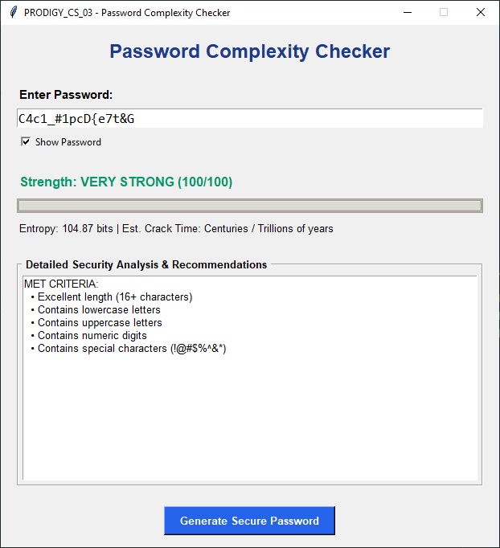

# PRODIGY_CS_03: Password Complexity Checker

[](https://prodigyinfotech.dev)
[](https://prodigyinfotech.dev)
[](https://www.python.org/)

---

## Overview

This project is developed as part of **Task 03** for the **Prodigy InfoTech Cyber Security Internship Track**. It provides an advanced, multi-criteria **Password Complexity Checker** that evaluates password strength based on length, character diversity, Shannon bit entropy, and dictionary attack resistance.

The application includes an interactive colorized Command Line Interface (CLI), scriptable CLI flags, a secure password generator, and a cross-platform Graphical User Interface (GUI) built with Tkinter.

---

## Project Features

- 🔐 **Multi-Criteria Strength Evaluation**: Assesses length, uppercase (`A-Z`), lowercase (`a-z`), numeric digits (`0-9`), and special characters (`!@#$%^&*`).
- 🧮 **Shannon Bit Entropy Calculation**: Computes exact mathematical entropy $E = L \times \log_2(R)$ to measure resistance against brute-force attacks.
- 🛑 **Common Dictionary Password Detection**: Flags top weak passwords (e.g. `123456`, `password`, `admin`) to prevent credential stuffing vulnerabilities.
- ⏱️ **Estimated Crack Time Calculation**: Estimates cracking duration based on modern 10 billion guesses/sec GPU array clusters.
- 💡 **Actionable Feedback & Suggestions**: Provides granular recommendations on missing security criteria.
- ⚡ **Built-In Cryptographically Secure Generator**: Generates high-entropy random passcodes using `secrets`.
- 🖥️ **Dual User Interface**: Interactive CLI menu and Tkinter Desktop GUI (`--gui`).
- 🧪 **Automated Testing**: 100% passing test suite (`test_password_checker.py`).

---

## Problem Statement

Build a tool that assesses the strength of a password based on criteria such as length, presence of uppercase and lowercase letters, numbers, and special characters. Provide real-time actionable feedback to users on the password's security posture.

---

## Tools and Technologies

| Component | Technology / Library | Description |
| :--- | :--- | :--- |
| **Language** | Python 3.x | Core programming language |
| **Pattern Matching** | `re` module | Regular expressions for character set detection |
| **Entropy Math** | `math` module | Logarithmic calculations |
| **Security Generator** | `secrets` module | Cryptographically secure pseudo-random number generator |
| **GUI Framework** | Tkinter | Desktop interface |
| **Testing** | `unittest` | Automated verification test suite |

---

## Architecture Diagram

```
                              ┌──────────────────────────────────┐
                              │           USER INPUT             │
                              └────────────────┬─────────────────┘
                                               │
                                               ▼
                              ┌──────────────────────────────────┐
                              │     Interface (CLI / GUI)        │
                              └────────────────┬─────────────────┘
                                               │
                                               ▼
                              ┌──────────────────────────────────┐
                              │   Password Evaluation Engine     │
                              └────────────────┬─────────────────┘
                                               │
            ┌──────────────────────────────────┼──────────────────────────────────┐
            ▼                                  ▼                                  ▼
┌──────────────────────┐           ┌──────────────────────┐           ┌──────────────────────┐
│  Character Analysis  │           │ Dictionary Check     │           │  Bit Entropy Math    │
│  (Upper, Lower,      │           │ (Match Top Common)   │           │  E = L * log2(R)     │
│   Digits, Symbols)   │           └──────────┬───────────┘           └──────────┬───────────┘
└───────────┬──────────┘                      │                                  │
            │                                 │                                  │
            └─────────────────────────────────┼──────────────────────────────────┘
                                              │
                                              ▼
                              ┌──────────────────────────────────┐
                              │    Scoring & Classification      │
                              │ (Very Weak -> Very Strong Score) │
                              └────────────────┬─────────────────┘
                                               │
                                               ▼
                              ┌──────────────────────────────────┐
                              │  Display Analysis & Recommendations │
                              └──────────────────────────────────┘
```

---

## Dashboard Screenshot

### Desktop Graphical User Interface (GUI)



---

### Command Line Interface (CLI) Console

```
=================================================================
        PRODIGY INFOTECH - CYBER SECURITY TASK 03
               PASSWORD COMPLEXITY CHECKER
=================================================================

Select an Option:
  [1] Assess Password Strength
  [2] Generate Secure Password
  [3] Launch Graphical Interface (GUI)
  [4] Exit

Enter choice (1/2/3/4): 1

Enter password to evaluate: K9#mP$9vL2!xQ18#

--------------------------------------------------
Password Evaluated : **************** (K9#mP$9vL2!xQ18#)
Overall Rating     : [VERY STRONG] (Score: 100/100)
Entropy Strength   : 104.88 bits
Est. Crack Time    : Centuries / Trillions of years
--------------------------------------------------
Met Criteria:
  [+] Excellent length (16+ characters)
  [+] Contains lowercase letters
  [+] Contains uppercase letters
  [+] Contains numeric digits
  [+] Contains special characters (!@#$%^&*)
--------------------------------------------------
```

---

## Methods

### 1. Entropy Calculation Formula

Password entropy $E$ measures randomness in bits:

$$E = L \times \log_2(R)$$

Where:
- $L$ is the length of the password.
- $R$ is the size of the character pool:
  - Lowercase (`a-z`): $R += 26$
  - Uppercase (`A-Z`): $R += 26$
  - Digits (`0-9`): $R += 10$
  - Special symbols: $R += 32$

### 2. Scoring & Classification Matrix

| Score Range | Rating | Color Code | Security Assessment |
| :--- | :--- | :--- | :--- |
| `0 - 20` | **Very Weak** | Red | Vulnerable to instant brute-force/dictionary attack |
| `21 - 40` | **Weak** | Orange | Inadequate length or character diversity |
| `41 - 60` | **Moderate** | Yellow | Acceptable for basic accounts |
| `61 - 80` | **Strong** | Light Green | Resistant to common cracking attempts |
| `81 - 100` | **Very Strong** | Bright Green | Highly secure (Recommended for production/admin) |

---

## Key Insights

1. **NIST SP 800-63B Guidelines**: Modern authentication standards emphasize **length over artificial complexity rules**. A long passphrase (e.g. `correct-horse-battery-staple`) offers higher entropy than short complex passwords.
2. **Dictionary & Credential Stuffing Attacks**: Attackers do not start with pure brute-force; they test common password dumps first. Dictionary checking is essential.
3. **Entropy Thresholds**:
   - $< 40$ bits: Weak (Crackable in seconds to minutes).
   - $40 - 60$ bits: Moderate.
   - $> 80$ bits: Cryptographically strong against GPU cluster brute-force attacks.

---

## How to Run this Project

### Prerequisites
- Python 3.8 or higher installed.

### Execution Instructions

1. **Navigate to Folder**:
   ```bash
   cd Prodigy_CS_03
   ```

2. **Run Interactive Menu**:
   ```bash
   python password_checker.py
   ```

3. **Run via Command-Line Flags**:
   - **Assess Password**:
     ```bash
     python password_checker.py -p "MyP@ssw0rd2026!"
     ```
   - **Generate Secure Password**:
     ```bash
     python password_checker.py -g -l 16
     ```

4. **Launch Graphical Interface (GUI)**:
   ```bash
   python password_checker.py --gui
   ```

---

## Results & Conclusion

### Test Verification Matrix (`test_password_checker.py`)

Executing `python test_password_checker.py`:

```
.....
----------------------------------------------------------------------
Ran 5 tests in 0.002s

OK
```

| Test Case | Description | Status |
| :--- | :--- | :--- |
| `test_weak_passwords` | Verifies flagging of common weak passwords (`123456`) | ✅ Passed |
| `test_moderate_password` | Verifies scoring of medium complexity passwords | ✅ Passed |
| `test_strong_password` | Verifies score 100 & high entropy ($>80$ bits) | ✅ Passed |
| `test_entropy_calculation` | Verifies mathematical accuracy of $E = L \times \log_2(R)$ | ✅ Passed |
| `test_generator` | Verifies cryptographically secure random password generator | ✅ Passed |

---

## Future Work

- 🌐 **HaveIBeenPwned API Integration**: Connect k-Anonymity HIBP API to check if a password has appeared in known data breaches.
- 🧠 **zxcvbn Spatial Pattern Matcher**: Implement neural pattern matching for keyboard spatial patterns (`qwerty`, `1q2w3e`).

---

## Author & Contact

- **Author**: Kaustubh Bangar
- **Track**: Cyber Security (CS)
- **Organization**: Prodigy InfoTech
- **Task**: Task 03 - Password Complexity Checker (`PRODIGY_CS_03`)
