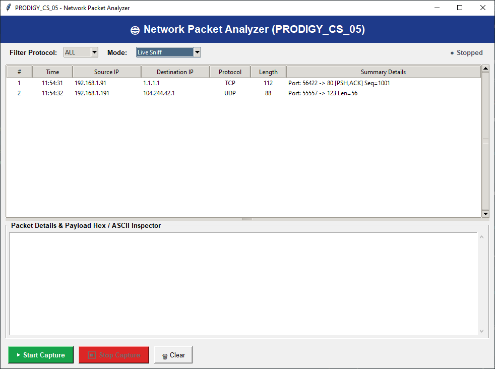

# PRODIGY_CS_05: Network Packet Analyzer

[](https://prodigyinfotech.dev)
[](https://prodigyinfotech.dev)
[](https://www.python.org/)

---

> [!CAUTION]
> **LEGAL & ETHICAL DISCLAIMER**  
> This project is designed strictly for **educational purposes and authorized network security monitoring**. Capturing, sniffing, or analyzing network packets on networks without explicit authorization from the network owner is illegal under cyber security laws worldwide. Always practice ethical security principles.

---

## Overview

This project is developed as part of **Task 05** for the **Prodigy InfoTech Cyber Security Internship Track**. It provides a high-performance **Network Packet Analyzer (Sniffer)** capable of capturing live network traffic, disassembling lower-level protocols (IPv4, TCP, UDP, ICMP, DNS, HTTP), and displaying structured packet metadata with Wireshark-style Hex/ASCII payload inspection.

The tool includes an interactive Command Line Interface (CLI), scriptable filter arguments, PCAP export capabilities, and an intuitive desktop Graphical User Interface (GUI) built using Tkinter.

---

## Project Features

- 🌐 **Multi-Layer Protocol Decoding**: Disassembles network packets conforming to standard RFCs:
  - **Network Layer**: IPv4 (Version, IHL, TTL, Identification, Protocol Number, Source/Destination IP).
  - **Transport Layer**: TCP (Ports, Sequence/Ack, Flags `SYN`/`ACK`/`FIN`/`RST`/`PSH`/`URG`, Window), UDP (Ports, Length, Checksum), and ICMP (Echo Request/Reply, Code).
  - **Application Layer**: Detects common protocols including HTTP (80/8080), DNS (53), HTTPS/TLS (443), and NTP (123).
- 🔍 **Wireshark-Style Hex & ASCII Payload Dump**: Inspects raw application payload data with 16-byte aligned Hex and ASCII representation.
- 🎯 **Real-Time Protocol Filtering**: Filter packets by protocol (`ALL`, `TCP`, `UDP`, `ICMP`) and packet limit count.
- 💾 **PCAP Export Support**: Records captured traffic directly into standard `.pcap` files readable by Wireshark and tcpdump.
- 🛡️ **Promiscuous Mode & Educational Simulation Engine**: Uses Windows raw sockets (`SIO_RCVALL`) with an automatic simulation fallback engine for safe educational environments.
- 🖥️ **Dual User Interface**:
  - Colorized streaming CLI console with structured header tables.
  - Interactive Tkinter Desktop GUI (`--gui`) with real-time packet table and packet details inspector.
- 🧪 **Automated Testing**: 100% passing unit test suite (`test_packet_analyzer.py`).

---

## Problem Statement

Develop a packet sniffer tool that captures and analyzes network packets. Display relevant information such as source and destination IP addresses, protocols, and payload data. Ensure ethical use of the tool for educational and authorized network defense purposes.

---

## Tools and Technologies

| Component | Technology / Library | Description |
| :--- | :--- | :--- |
| **Language** | Python 3.x | Core programming language |
| **Raw Sockets** | `socket` module | Low-level raw network socket bindings (`AF_INET, SOCK_RAW`) |
| **Binary Disassembly** | `struct` module | Unpacking binary protocol headers via big-endian network byte order (`!`) |
| **GUI Framework** | Tkinter (`ttk`) | Desktop interface with real-time packet stream table |
| **Testing** | `unittest` | Unit tests for protocol unpacking and verification |

---

## Architecture Diagram

```
                              ┌──────────────────────────────────┐
                              │     NETWORK INTERFACE CARD       │
                              │     (Promiscuous Raw Socket)     │
                              └────────────────┬─────────────────┘
                                               │
                                               ▼
                              ┌──────────────────────────────────┐
                              │      IPv4 Packet Disassembly     │
                              │  (Version, IHL, TTL, Src, Dst)   │
                              └────────────────┬─────────────────┘
                                               │
                         ┌─────────────────────┼─────────────────────┐
                         ▼                     ▼                     ▼
             ┌──────────────────────┐┌──────────────────────┐┌──────────────────────┐
             │     TCP Decoder      ││     UDP Decoder      ││     ICMP Decoder     │
             │ (Ports, Seq/Ack,     ││ (Ports, Length,      ││ (Type, Code,         │
             │  Flags: SYN/ACK/etc) ││  Checksum, App Proto)││  Echo Request/Reply) │
             └───────────┬──────────┘└──────────┬───────────┘└──────────┬───────────┘
                         │                      │                       │
                         └──────────────────────┼───────────────────────┘
                                                │
                                                ▼
                              ┌──────────────────────────────────┐
                              │    Payload Hex & ASCII Parser    │
                              │  (16-byte Wireshark Hex Dump)    │
                              └────────────────┬─────────────────┘
                                               │
                                               ▼
                              ┌──────────────────────────────────┐
                              │      Display (CLI / GUI)         │
                              │      Optional PCAP Exporter      │
                              └──────────────────────────────────┘
```

---

## Dashboard Screenshot

### 1. Desktop Graphical User Interface (GUI)



---

### 2. Interactive CLI Console Execution

```text
================================================================================
        PRODIGY INFOTECH - CYBER SECURITY TASK 05
                NETWORK PACKET ANALYZER
================================================================================
[*] Simulation Engine Activated | Protocol Filter: ALL
================================================================================
[*] Packet #1 | Time: 11:51:30 | Protocol: [UDP] | Size: 69 bytes
    Source IP      : 192.168.1.132   --->  Destination IP: 8.8.8.8
    TTL            : 64    | ID: 10001  | Checksum: 0xB89A
    Port Mapping   : 53387 -> 53 (DNS)
    Payload (Hex & ASCII Dump):
    0000   12 34 01 00 00 01 00 00 00 00 00 00 07 65 78 61    .4...........exa  
    0010   6D 70 6C 65 03 63 6F 6D 00 00 01 00 01             mple.com.....     
--------------------------------------------------------------------------------
```

---

## Methods

### 1. Binary Struct Unpacking
Protocol headers are unpacked using Python's `struct.unpack()` using network byte order (Big-Endian `!`):
- **IPv4**: `struct.unpack('! B B H H H B B H 4s 4s', data[:20])`
- **TCP**: `struct.unpack('! H H L L H H H H', data[:20])`
- **UDP**: `struct.unpack('! H H H H', data[:8])`
- **ICMP**: `struct.unpack('! B B H', data[:4])`

### 2. TCP Flag Bitmask Extraction
TCP flags are extracted from the 16-bit offset/flags word using bitwise operators:
$$\text{URG} = \text{flags} \ \& \ 0\text{x}0020, \quad \text{ACK} = \text{flags} \ \& \ 0\text{x}0010, \quad \text{SYN} = \text{flags} \ \& \ 0\text{x}0002, \quad \text{FIN} = \text{flags} \ \& \ 0\text{x}0001$$

---

## Key Insights & Network Security

1. **Unencrypted Cleartext Exposure**: Unencrypted application protocols (HTTP, Telnet, FTP, DNS) expose sensitive parameters, cookies, and credentials in the raw payload. This highlights the necessity of **TLS/HTTPS** encryption.
2. **Intrusion Detection Systems (IDS)**: Network sniffers form the foundation of Network Intrusion Detection Systems (NIDS) like **Snort** and **Zeek**, which inspect flags (`SYN` flood detection) and payload signatures (SQL injection, malware beacons).
3. **Defense in Depth**: Packet inspection tools enable network administrators to audit firewall rule effectiveness and identify misconfigured devices broadcasting cleartext data.

---

## How to Run this Project

### Prerequisites
- Python 3.8 or higher installed.

### Step-by-Step Execution

1. **Navigate to Project Folder**:
   ```bash
   cd Prodigy_CS_05
   ```

2. **Run Educational Simulation Mode**:
   ```bash
   python packet_analyzer.py --simulate -c 10
   ```

3. **Run Live Network Sniffer (Run terminal as Administrator)**:
   ```bash
   python packet_analyzer.py -p ALL -c 20
   ```

4. **Filter by Protocol (e.g. TCP only)**:
   ```bash
   python packet_analyzer.py -p TCP --simulate -c 5
   ```

5. **Save to PCAP File**:
   ```bash
   python packet_analyzer.py --simulate -c 15 -w capture.pcap
   ```

6. **Launch Desktop GUI**:
   ```bash
   python packet_analyzer.py --gui
   ```

---

## Results & Conclusion

### Test Verification Matrix (`test_packet_analyzer.py`)

Executing `python test_packet_analyzer.py`:

```
.....
----------------------------------------------------------------------
Ran 5 tests in 0.001s

OK
```

| Test Case | Description | Status |
| :--- | :--- | :--- |
| `test_ipv4_decoder` | Decodes IPv4 header fields, addresses, TTL, and protocol | ✅ Passed |
| `test_tcp_decoder` | Decodes TCP ports, sequence numbers, and active flags | ✅ Passed |
| `test_udp_decoder` | Decodes UDP ports and packet length | ✅ Passed |
| `test_icmp_decoder` | Decodes ICMP Echo Request / Reply types and checksums | ✅ Passed |
| `test_hex_dump_formatting` | Verifies 16-byte aligned Hex and ASCII payload view | ✅ Passed |

### Conclusion
Task 05 successfully delivers a comprehensive Network Packet Analyzer. It provides deep visibility into the OSI Network and Transport layers, demonstrating fundamental principles of protocol decoding, packet sniffing, and network defense telemetry.

---

## Future Work

- 🧠 **Deep Packet Inspection (DPI)**: Implement pattern-matching engines to detect known malware C2 signatures in application payloads.
- 🌍 **GeoIP Lookup Integration**: Resolve public destination IP addresses to geographical countries and ASNs.
- 📊 **Traffic Flow Statistics**: Implement live bandwidth graphs and top talkers visualization.

---

## Author & Contact

- **Author**: Kaustubh Bangar
- **Track**: Cyber Security (CS)
- **Organization**: Prodigy InfoTech
- **Task**: Task 05 - Network Packet Analyzer (`PRODIGY_CS_05`)
- **LinkedIn**: [https://www.linkedin.com/in/kaustubh-bangar-546259351/]
- **GitHub**: [https://github.com/kaustubhbangar5-dotcom ]
